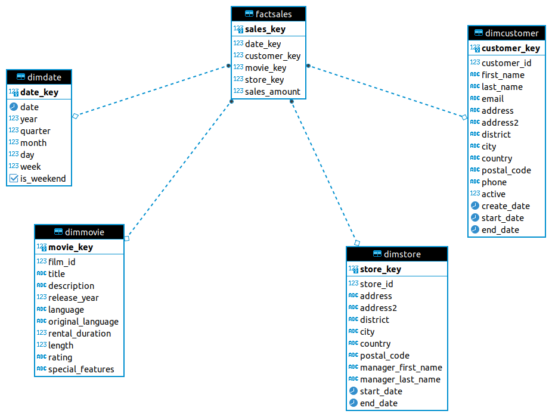

## Introduction 

    -Database called Pagila build upon (OLTP) system contain data about the films with multi tables(stores, revenues,...).
    -The customer wants to convert this OLTP system to an OLAP system for analysis purposes.

## Objective of OLAP system 

    -The OLAP system is the main system created for analysis purposes by using the STAR schema or SNOWFLAKE schema.
    -The main impact of these schemas is to reduce the time of executing the query and make queries more readable.

## Steps 

    -Analysis the content of the DB(pagila) by executing random queries.
    -Create UML for the star schema (Fact & Dimension tables).
    -Create the Fact and Dimensionals tables.
    -Build ETL sql2sql to fill the tables.
    -Build a cube and compare the performance with the query from the OLTP system.

## UML-Digram
    
